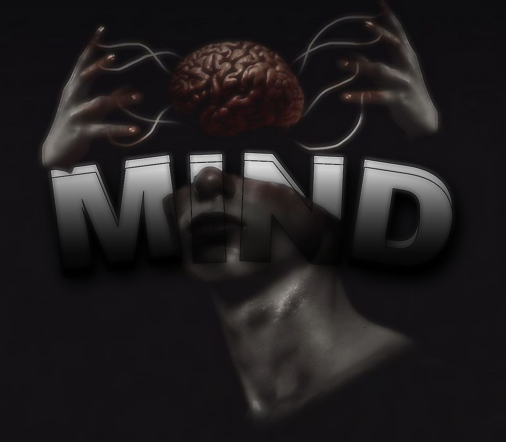

<h1 align='center'><b>MIND - ATLAS</b></h1>

### Introduction:

👋 Hi Everyone!

This project introduces Mind-Atlas, an Artificial Intelligence Bot for WhatsApp. It is based on the Mixtral-8x7B-Instruct-v0.1 model from Mixtral A.I and uses HuggingFace as the access point for chatting.

### Description:

<strong>To use this bot, you need to have Node.js installed on your machine to be able to use it.</strong>

To use this bot, consider the <strong><cite>config.json</cite></strong> file in the root directory and configure it. Also, check the <strong><cite>apis.json</cite></strong> file in <strong><cite>/lib/utils/</cite></strong> and modify the <strong>"HUGGINGFACE_API_TOKEN"</strong> to enable the bot to send prompts and receive responses. Start the bot with "<strong>node app.js</strong>" in the terminal, after making the changes mentioned above.

## Licenses:

### [Mixtral A.I](https://docs.mistral.ai/getting-started/models/weights/#license)
### [Mind-atlas](./LICENSE)
### [4Devs](https://www.4devs.com.br/termos_de_uso)

## Technologics:

 

 

